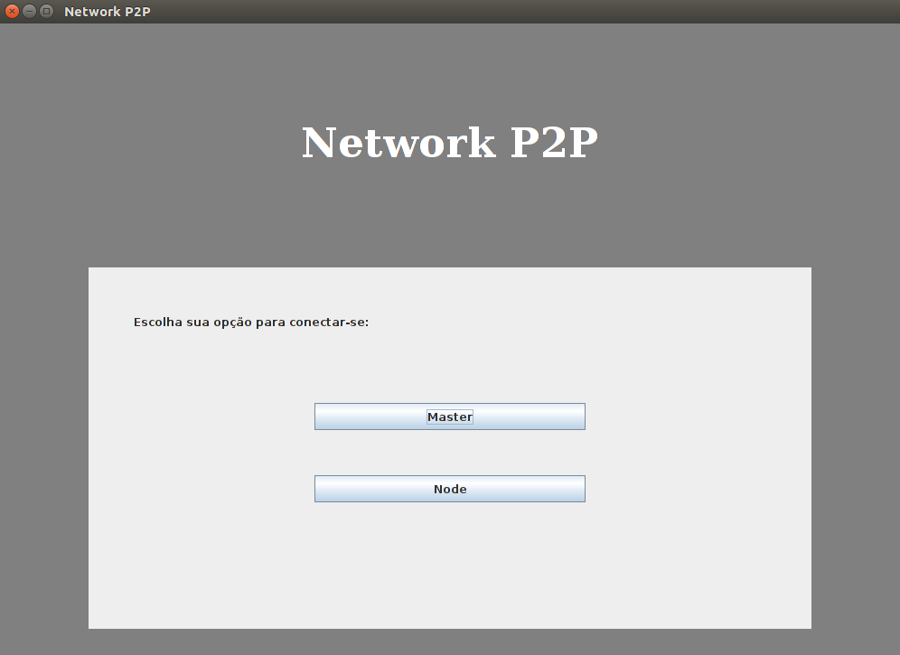
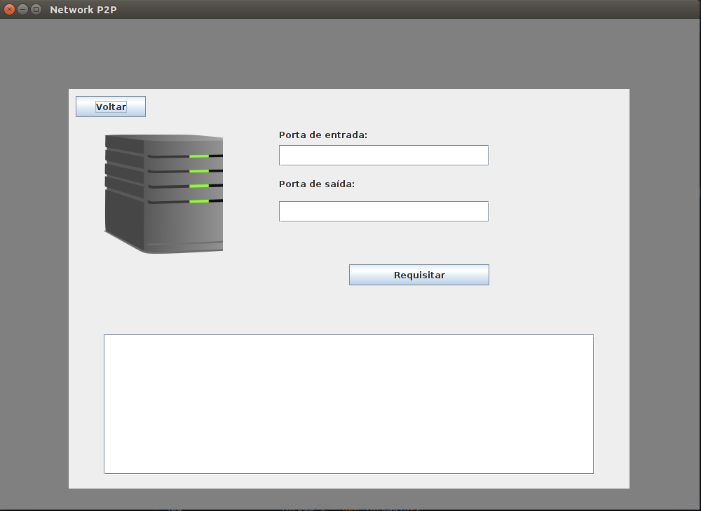
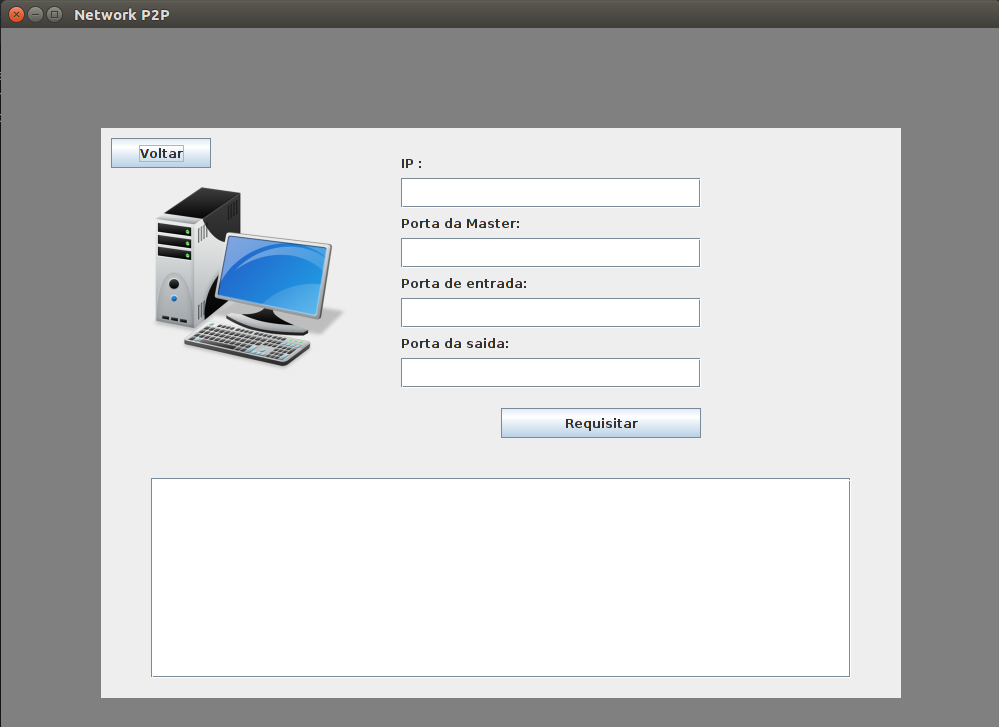

# Lista 6 - Network P2P

## Integrantes:

| Nome       | Matrícula      |
| ---------- | -------------- |
| 16/0123186 | Guilherme Guy  |
| 16/0128013 | Joberth Rogers |

## Conceito

Como o objetivo desse ultimo trabalho era fazer a implementação envolvendo dois ou mais algoritmos 
lecionados na matéria de PA. A dupla resolveu implementar um algoritmo com a arquitetura 
Peer to Peer (ou P2P), envolvendo a parte de grafos, onde há nós e esses nós são conectados com todos os outros. 
Ao executar o programa, o usuário tem a opção de ser um nó master (responsável por enviar atividades para outros nós), 
ou um nó comum (recebe tarefas do nó master e tem a responsabilidade de executar com exatidão o código requisitado). O segundo 
algoritmo implementado foi um tipo de algoritmo genético que tem o objetivo de gerar números aleatórios para a mega sena, esse 
algoritmo é um tipo de algoritmo genético evolutivo onde a cada "época" um novo resultado é encontrado e refinado pelas restrições 
envolvidas.

# Instruções

* Ao executar o programa o usuário irá se deparar com essa tela:
* O usuário poderá escolher entre nó e nó master.

* Se a pessoa escolher o nó master, essa tela aparecerá:
* O usuário entrará com a porta de entrada e saída que os dados navegarão na arquitetura. Em seguida, o programa irá esperar por conexões.

* Se tiver um nó master já conectado, basta escolher a opção nó e essa tela aparecerá:
* Os dados necessários para o funcionamento será o IP da master, porta que ele está rodando e as portas que o nó estará processado o algoritmo genetico.
* Após isso é só aguardar os comandos da master.

